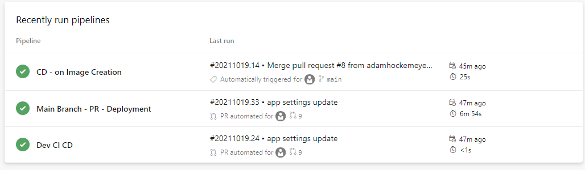
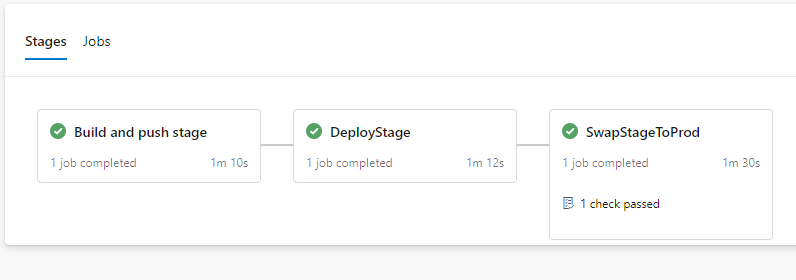

# App Service Containers Blue Green Deployments (Slot Swap)

## Goal
Deploy an app to app service and utilize a PR trigger to deploy to a pre-prod/stage envronment/slot to perform final validation checks.  Finally, utilize an envrionment approval check before swapping pre-prod/stage into production.

## Dev CI/CD
---
`azure-pipelines.yml`

For a development environment, you may want continuous integration (builds) _and_ continuous deployment (releases).  The `azure-pipelines.yml` pipeline in this example triggers on the `dev` branch when changes are pushed.  This pipeline will build the container image, tag it with a build id, and push it to Azure Container Registry.  The next step deploys the image with the specific build id tag to an Azure App Service dev slot.

## Main Branch - PR - Deployment
---
`azure-pipelines-main-pr.yml`

This pipeline will trigger on a pull request (PR) with main as the target of the pull request.

The difference here is that the pipeline will build/push the image to the registry and then deploy it to the staging slot as an example of a pre-production environment.  This will give you a live url to do any final checks if needed before promoting it to production.

As a check, an approval has been added in the Production Slot environment.  This means that before continuing on and deploying directly into the Production Slot environment, the specified approver must make an approval decision.  

Once the approver has approved, the deployment can continue.  In this case the deployment will swap the `Stage Slot` into the `Production Slot`.  The swap will also, as swap suggests, move was was in production slot into the staging slot, allowing the capability to revert back to the previous version.

## Pipeline container resources
---
`azure-pipelines-container-cd.yml`

This pipeline is a skeleton, but shows the capability for a pipeline to trigger based on a new container image being pushed into Azure Container Registry.  The container resource can be filtered down to only run the pipeline when a new image is available which contains a certain tag.  If you didn't want to build a container image, but simply deploy when a new image is available, you could evaluate this option.
